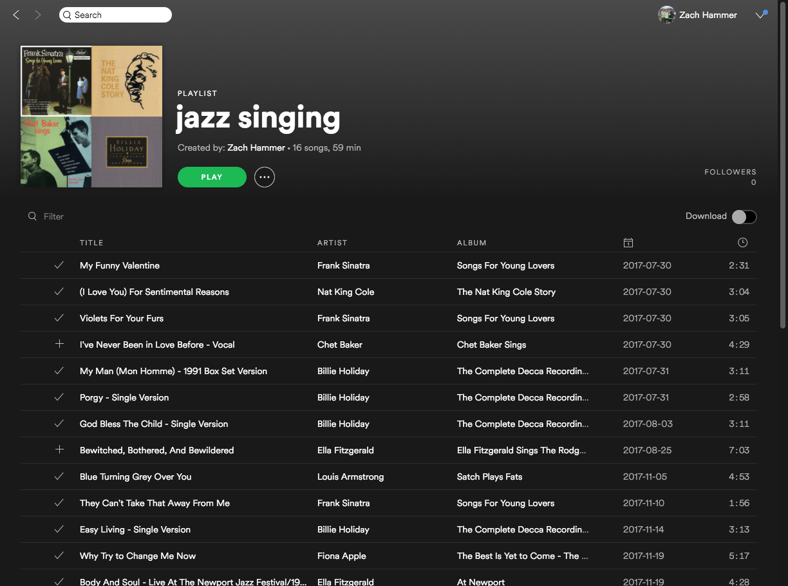
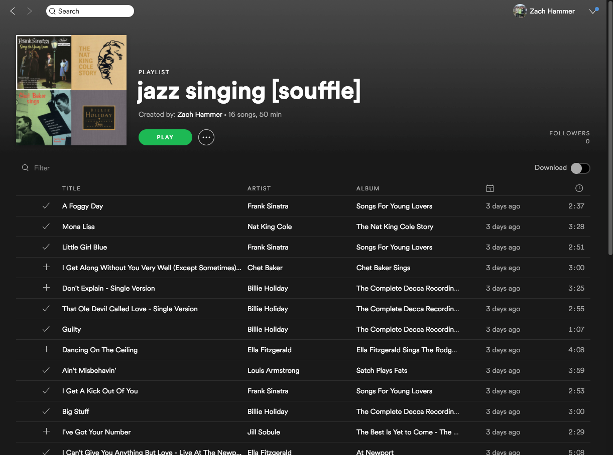

# playlist-souffle
Breathe life into an old playlist by swapping out each track for another track on the same album or by the same artist.

Before souffle              |  After souffle (by album)
:--------------------------:|:-------------------------:
  |  

### REST API

Check out the API documentation on [swagger](https://app.swaggerhub.com/apis/zhammer/playlist-souffle/1.0.0-oas3).

### Setting up the virtual environment (using [pipenv](https://docs.pipenv.org/))
```bash
pipenv shell
```

### [scripts/souffle_tester.py](scripts/souffle_tester.py)
```
usage: souffle_tester.py [-h] -a ACCESS_TOKEN [-l] -p PLAYLIST_URI -s
                         {artist,album} -u USER_ID

Souffle a playlist using the /souffle endpoint or a local lambda invocation

optional arguments:
  -h, --help            show this help message and exit
  -a ACCESS_TOKEN, --access-token ACCESS_TOKEN
                        Spotify access token. See -h for access token
                        instructions.
  -l, --local           If set, process the souffle request via a local lambda
                        invocation.
  -p PLAYLIST_URI, --playlist-uri PLAYLIST_URI
                        Uri of the playlist to be souffled. Original playlist
                        will not be altered.
  -s {artist,album}, --shuffle-by {artist,album}
                        Collection type to shuffle by.
  -u USER_ID, --user-id USER_ID
                        User id of account where souffled playlist will be
                        created.

Send a POST request to the /souffle endpoint to souffle a playlist. If the --local
flag is set, process the request via a local lambda invocation. On success, the
newly created playlist's uri is printed to stdout. Otherwise, an error message printed
to stderr.

* Obtaining a spotify accesstoken *
1. Visit "https://accounts.spotify.com/authorize?client_id=b231329aba1a4c539375436a267db917&response_type=code&redirect_uri=https://127.0.0.1:8100&scope=playlist-modify-public"
2. Enter your spotify username and password to grant playlist-modify-public scope.
3. Copy the authorization code returned as a url parameter: "/?code={AUTHORIZATION_CODE}"
   - Auth redirection will error, but the auth code can still be extracted from the url.
4. Use the scripts/refreshtoken.sh script to obtain a refresh token and access token
5. If your access token expires, use the scripts/accesstoken.sh script to obtain a fresh access token.
```

### Spotify authorization flow
For more information on the spotify authorization flow (i.e, auth codes, refresh tokens and access tokens, see: https://beta.developer.spotify.com/documentation/general/guides/authorization-guide/.
